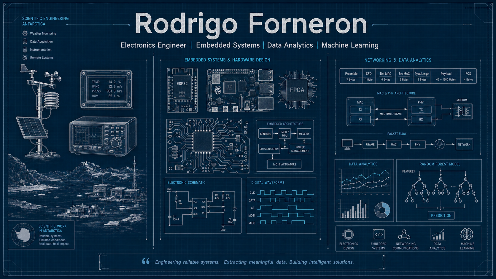

  

### Electronics Engineer (92%) | Embedded Systems Developer | Data Analytics | Machine Learning

I am an advanced Electronics Engineering student passionate about technology, embedded systems, data analysis, and machine learning.

My background combines hardware, software, communications, and data-driven problem solving, allowing me to work across multiple engineering domains.

---

## 🚀 About Me

🎓 Advanced Electronics Engineering Student

🔌 Interested in Embedded Systems and Digital Design

📡 Currently studying Communication Protocols for Embedded Systems

🤖 Machine Learning Practitioner focused on Fraud Detection

📊 Data Analytics and Predictive Modeling

🌎 Former Scientific Technician in Antarctica

---

## 🔬 Professional Experience

### 🇦🇶 Scientific Technician
**Belgrano II Antarctic Base (2024)**

Worked as Scientific Technician supporting research activities in Antarctica.

Main responsibilities:

- Maintenance of scientific instrumentation
- Calibration of measurement equipment
- Data acquisition and validation
- Processing and analysis of scientific datasets
- Technical support for field operations

---

### ⚡ Data Analytics & Fraud Detection
**EPEC (2025 - Present)**

Currently working on data analysis and machine learning initiatives focused on improving fraud detection effectiveness.

Main activities:

- Feature Engineering
- Data Analytics
- Predictive Modeling
- Random Forest Development
- Scoring Systems
- Large Scale Data Processing
- Decision Support Tools

Currently involved in the deployment of a machine learning based scoring platform for anomaly detection.

---

## 🛠️ Technical Skills

### Programming Languages

  
  
  
  
  
  

---

### Embedded Systems

  
  
  
  
  

---

### Data Science & Machine Learning

  
  
  

---

### Engineering Tools

  
  
  

---

## 📚 Currently Learning

Communication Protocols for Embedded Systems:

- Ethernet
- MAC
- MII / XGMII
- PCS
- UDP/IP
- Hardware Verification
- Network Analysis with Wireshark

---

## 📂 Featured Projects

### 🔍 Fraud Detection Scoring System

Machine Learning solution based on Random Forest models for anomaly and fraud detection.

### 📡 Embedded Systems Laboratory

Collection of ESP32 and Raspberry Pi projects.

### 🌐 Ethernet Communication Labs

Practical projects involving MAC, MII, PCS and packet analysis.

### 📊 Data Analytics Toolkit

Python tools for data processing, feature engineering and predictive analytics.

---

## 📫 Connect With Me

- LinkedIn: www.linkedin.com/in/rodrigo-forneron-a4357b233/
- Email: rodrigoo.forneron@gmail.com
---

### 💡 Engineering Philosophy

> Build. Measure. Learn. Improve. Repeat.
``
